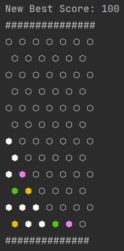

# Backdrop Placement for FTC Centerstage

### Author: T-Lind

A simple tool to help you place your pixels in Centerstage.

## Overview:

What's the technically best way to place your pixels in Centerstage? This tool will help you figure that out.
Or, more specifically, it would if it was faster. It uses DFS to find the best placement, but it's too slow to be useful
past ~8 pixels.
I'm sure you could do something like A* but I'm to lazy to make a heuristic.

## Usage:

- `dfs.py` uses a simple depth-first search in order to find the best placement of a random array of pixels.
- `bfs.py` uses breadth-first search, but I really wouldn't recommend it, since the frontiers get too big too fast.
- `greedy_dfs.py` does DFS but sorts first by score. However, I think it's actually slower than regular DFS.
- `parallel_dfs.py` uses the `multiprocessing` library to send out multiple searches at once. It's the fastest, but it's
  still too slow to be useful.
- `one_deep.py` just performs a simple comparison of where to place one pixel, only looking at what maximizes the
  immediate score the most

## Example:  
  
Result of running `parallel_dfs.py` for about a minute or so.